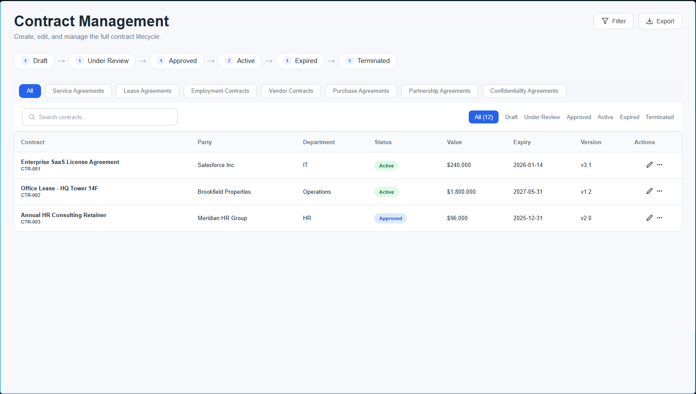

# 📄 Contract Repository

A modern Contract Repository and Management System built using **React (Vite)** for the frontend and **FastAPI** for the backend.

The application helps organizations manage contracts throughout their lifecycle, including creating, searching, filtering, and organizing contracts efficiently.

---

## 🚀 Features

- 📋 View all contracts in a responsive table
- ➕ Create new contracts using a modal form
- 🔍 Search contracts by ID, Name, or Party
- 📂 Filter contracts by Category
- 📌 Filter contracts by Status
- 🏷️ Status badges with different colors
- 📱 Responsive UI
- ⚡ FastAPI backend
- ⚛️ React + Vite frontend

---

## 🛠️ Tech Stack

### Frontend
- React
- Vite
- React Icons
- CSS3

### Backend
- FastAPI
- Python
- Uvicorn

---

# 📁 Project Structure

```
contract-repo/
│
├── client/
│   ├── src/
│   ├── public/
│   └── package.json
│
├── server/
│   ├── src/
│   ├── requirements.txt
│   └── main.py
│
├── .gitignore
└── README.md
```

---

# ⚙️ Installation

## Clone Repository

```bash
git clone <your-repository-url>
cd contract-repo
```

---

## Frontend Setup

```bash
cd client

npm install

npm run dev
```

Frontend runs at:

```
http://localhost:5173
```

---

## Backend Setup

Create virtual environment

```bash
cd server

python -m venv venv
```

Activate it

### Windows

```bash
venv\Scripts\activate
```

### Linux / Mac

```bash
source venv/bin/activate
```

Install dependencies

```bash
pip install -r requirements.txt
```

Run FastAPI

```bash
uvicorn src.main:app --reload
```

Backend runs at:

```
http://127.0.0.1:8000
```

---

## 📸 Features Implemented

- Contract Repository Dashboard
- Search Contracts
- Status Filters
- Category Filters
- New Contract Modal
- Dynamic Table Updates
- Dummy Data Integration
- Responsive Design

---

## 🔮 Future Enhancements

- Database Integration
- Authentication & Authorization
- Contract Editing
- Delete Contracts
- Import / Export Contracts
- File Upload Support
- Dashboard Analytics

---

## 👩‍💻 Author

**Pragna Sree**

Built as part of a Contract Management project using React and FastAPI.


