# Contract Management System — Private ER Diagram & Schema Reference

> **PRIVATE — Internal Use Only**
> This document contains full schema details, field-level descriptions, constraints,
> indexes, and architectural decisions. Do not distribute.

---

## Table of Contents

1. [Entity Relationship Diagram](#er-diagram)
2. [Module → Table Mapping](#module--table-mapping)
3. [Table Descriptions](#table-descriptions)
4. [Enum Types Reference](#enum-types-reference)
5. [Index Strategy](#index-strategy)
6. [Key Relationships](#key-relationships)
7. [Views](#views)
8. [Design Decisions](#design-decisions)

---

## ER Diagram

```mermaid
erDiagram

    users {
        UUID        id               PK
        VARCHAR     employee_id      UK
        VARCHAR     first_name
        VARCHAR     last_name
        VARCHAR     email            UK
        VARCHAR     phone
        TEXT        password_hash
        ENUM        role
        UUID        department_id    FK
        BOOLEAN     is_active
        BOOLEAN     is_email_verified
        TEXT        avatar_url
        TIMESTAMPTZ last_login_at
        TIMESTAMPTZ password_changed_at
        INT         failed_login_count
        TIMESTAMPTZ locked_until
        UUID        created_by       FK
        TIMESTAMPTZ created_at
        TIMESTAMPTZ updated_at
        TIMESTAMPTZ deleted_at
    }

    departments {
        UUID    id          PK
        VARCHAR name        UK
        VARCHAR code        UK
        TEXT    description
        UUID    head_id     FK
        UUID    parent_id   FK
        BOOLEAN is_active
        TIMESTAMPTZ created_at
        TIMESTAMPTZ updated_at
    }

    user_sessions {
        UUID        id                  PK
        UUID        user_id             FK
        TEXT        token_hash          UK
        TEXT        refresh_token_hash  UK
        INET        ip_address
        TEXT        user_agent
        BOOLEAN     is_active
        TIMESTAMPTZ expires_at
        TIMESTAMPTZ created_at
        TIMESTAMPTZ revoked_at
    }

    password_reset_tokens {
        UUID        id          PK
        UUID        user_id     FK
        TEXT        token_hash  UK
        TIMESTAMPTZ expires_at
        TIMESTAMPTZ used_at
        TIMESTAMPTZ created_at
    }

    permissions {
        UUID    id          PK
        VARCHAR resource
        VARCHAR action
        TEXT    description
    }

    role_permissions {
        ENUM        role            PK
        UUID        permission_id   PK,FK
        TIMESTAMPTZ granted_at
        UUID        granted_by      FK
    }

    contracts {
        UUID        id                  PK
        VARCHAR     contract_number     UK
        VARCHAR     title
        TEXT        description
        ENUM        category
        ENUM        status
        VARCHAR     counterparty_name
        VARCHAR     counterparty_email
        VARCHAR     counterparty_phone
        TEXT        counterparty_address
        UUID        department_id       FK
        UUID        owner_id            FK
        UUID        assigned_manager_id FK
        NUMERIC     value
        CHAR        currency
        DATE        start_date
        DATE        end_date
        DATE        signed_date
        DATE        effective_date
        BOOLEAN     auto_renew
        INT         renewal_notice_days
        BOOLEAN     is_confidential
        TEXT_ARRAY  tags
        JSONB       metadata
        UUID        created_by          FK
        TIMESTAMPTZ created_at
        TIMESTAMPTZ updated_at
        TIMESTAMPTZ deleted_at
    }

    contract_versions {
        UUID        id              PK
        UUID        contract_id     FK
        INT         version_number
        VARCHAR     file_name
        TEXT        file_path
        BIGINT      file_size
        VARCHAR     file_mime_type
        VARCHAR     checksum
        TEXT        change_summary
        BOOLEAN     is_current
        UUID        uploaded_by     FK
        TIMESTAMPTZ created_at
    }

    approval_workflows {
        UUID        id              PK
        VARCHAR     name
        TEXT        description
        ENUM        category
        INT         steps_count
        BOOLEAN     is_active
        TIMESTAMPTZ created_at
        TIMESTAMPTZ updated_at
    }

    approval_workflow_steps {
        UUID    id          PK
        UUID    workflow_id FK
        INT     step_order
        VARCHAR step_name
        ENUM    approver_role
        UUID    approver_id FK
        BOOLEAN is_mandatory
    }

    contract_approvals {
        UUID        id          PK
        UUID        contract_id FK
        UUID        workflow_id FK
        UUID        step_id     FK
        UUID        approver_id FK
        ENUM        action
        TEXT        comments
        TIMESTAMPTZ acted_at
        TIMESTAMPTZ created_at
    }

    contract_comments {
        UUID        id          PK
        UUID        contract_id FK
        UUID        parent_id   FK
        UUID        author_id   FK
        TEXT        body
        BOOLEAN     is_internal
        TIMESTAMPTZ created_at
        TIMESTAMPTZ updated_at
        TIMESTAMPTZ deleted_at
    }

    tags {
        UUID    id      PK
        VARCHAR name    UK
        VARCHAR color
    }

    contract_tag_map {
        UUID contract_id PK,FK
        UUID tag_id      PK,FK
    }

    document_archives {
        UUID        id              PK
        UUID        contract_id     FK
        UUID        version_id      FK
        UUID        archived_by     FK
        TEXT        archive_reason
        TEXT        storage_path
        VARCHAR     checksum
        TIMESTAMPTZ archived_at
        TIMESTAMPTZ restore_at
        UUID        restored_by     FK
    }

    obligations {
        UUID        id                  PK
        UUID        contract_id         FK
        VARCHAR     title
        TEXT        description
        ENUM        obligation_type
        ENUM        status
        UUID        responsible_user_id FK
        UUID        responsible_dept_id FK
        DATE        due_date
        INT         reminder_days
        TEXT        recurrence_rule
        NUMERIC     amount
        CHAR        currency
        DATE        completion_date
        TEXT        completion_notes
        TEXT        evidence_url
        SMALLINT    priority
        ENUM        compliance_level
        TEXT_ARRAY  tags
        UUID        created_by          FK
        TIMESTAMPTZ created_at
        TIMESTAMPTZ updated_at
        TIMESTAMPTZ deleted_at
    }

    obligation_progress {
        UUID        id              PK
        UUID        obligation_id   FK
        SMALLINT    progress_pct
        TEXT        note
        UUID        recorded_by     FK
        TIMESTAMPTZ recorded_at
    }

    renewals {
        UUID        id                  PK
        UUID        contract_id         FK
        INT         renewal_number
        ENUM        status
        DATE        previous_end_date
        DATE        new_start_date
        DATE        new_end_date
        NUMERIC     new_value
        CHAR        currency
        TIMESTAMPTZ reminder_sent_at
        INT         reminder_days
        UUID        approved_by         FK
        TIMESTAMPTZ approved_at
        TEXT        notes
        TEXT        renewal_doc_path
        UUID        created_by          FK
        TIMESTAMPTZ created_at
        TIMESTAMPTZ updated_at
    }

    renewal_approvals {
        UUID        id          PK
        UUID        renewal_id  FK
        UUID        approver_id FK
        ENUM        action
        TEXT        comments
        TIMESTAMPTZ acted_at
    }

    compliance_records {
        UUID        id                  PK
        UUID        contract_id         FK
        UUID        obligation_id       FK
        ENUM        compliance_level
        DATE        review_date
        UUID        reviewed_by         FK
        SMALLINT    risk_score
        TEXT        findings
        TEXT        recommendations
        TEXT        evidence_url
        DATE        next_review_date
        BOOLEAN     is_resolved
        TIMESTAMPTZ resolved_at
        UUID        resolved_by         FK
        TIMESTAMPTZ created_at
        TIMESTAMPTZ updated_at
    }

    notifications {
        UUID        id              PK
        UUID        user_id         FK
        ENUM        type
        ENUM        channel
        ENUM        status
        VARCHAR     subject
        TEXT        body
        VARCHAR     reference_type
        UUID        reference_id
        TIMESTAMPTZ scheduled_at
        TIMESTAMPTZ sent_at
        TIMESTAMPTZ delivered_at
        TIMESTAMPTZ read_at
        INT         retry_count
        TEXT        error_message
        JSONB       metadata
        TIMESTAMPTZ created_at
    }

    notification_templates {
        UUID        id          PK
        VARCHAR     name        UK
        ENUM        type
        ENUM        channel
        VARCHAR     subject
        TEXT        body_html
        TEXT        body_text
        TEXT_ARRAY  variables
        BOOLEAN     is_active
        TIMESTAMPTZ created_at
        TIMESTAMPTZ updated_at
    }

    reports {
        UUID        id              PK
        ENUM        report_type
        VARCHAR     title
        TEXT        description
        JSONB       parameters
        ENUM        export_format
        TEXT        file_path
        BIGINT      file_size
        UUID        generated_by    FK
        TIMESTAMPTZ generated_at
        TIMESTAMPTZ expires_at
        INT         download_count
        BOOLEAN     is_scheduled
        VARCHAR     schedule_cron
        TIMESTAMPTZ created_at
    }

    audit_logs {
        UUID        id              PK
        UUID        user_id         FK
        ENUM        action
        VARCHAR     resource_type
        UUID        resource_id
        VARCHAR     resource_label
        JSONB       old_values
        JSONB       new_values
        INET        ip_address
        TEXT        user_agent
        UUID        session_id      FK
        VARCHAR     request_id
        SMALLINT    status_code
        INT         duration_ms
        TIMESTAMPTZ created_at
    }

    activities {
        UUID        id              PK
        UUID        actor_id        FK
        VARCHAR     verb
        VARCHAR     object_type
        UUID        object_id
        VARCHAR     object_label
        VARCHAR     target_type
        UUID        target_id
        VARCHAR     target_label
        UUID        department_id   FK
        JSONB       metadata
        TIMESTAMPTZ created_at
    }

    system_settings {
        VARCHAR     key         PK
        TEXT        value
        TEXT        description
        TIMESTAMPTZ updated_at
        UUID        updated_by  FK
    }

    %% ── RELATIONSHIPS ──────────────────────────────────────────

    users              }o--||  departments               : "belongs_to"
    departments        ||--o{  users                     : "has_members"
    departments        |o--o|  departments                : "parent_of"
    departments        |o--||  users                     : "headed_by"

    users              ||--o{  user_sessions              : "has"
    users              ||--o{  password_reset_tokens      : "requests"
    role_permissions   }o--||  permissions                : "grants"

    users              ||--o{  contracts                  : "owns"
    departments        ||--o{  contracts                  : "holds"
    contracts          ||--o{  contract_versions          : "has_versions"
    contracts          ||--o{  contract_approvals         : "goes_through"
    contracts          ||--o{  contract_comments          : "has_comments"
    contracts          ||--o{  contract_tag_map           : "tagged_with"
    contract_tag_map   }o--||  tags                       : "uses"
    contracts          ||--o{  document_archives          : "archived_in"
    contract_versions  ||--o{  document_archives          : "version_of"

    approval_workflows  ||--o{  approval_workflow_steps   : "has_steps"
    approval_workflows  ||--o{  contract_approvals        : "used_in"
    approval_workflow_steps ||--o{ contract_approvals     : "referenced_by"
    users               ||--o{  contract_approvals        : "approves"

    contracts          ||--o{  obligations                : "has"
    users              ||--o{  obligations                : "responsible_for"
    departments        ||--o{  obligations                : "responsible_dept"
    obligations        ||--o{  obligation_progress        : "tracked_by"
    obligations        ||--o{  compliance_records         : "assessed_in"

    contracts          ||--o{  renewals                   : "renewed_as"
    renewals           ||--o{  renewal_approvals          : "approved_via"
    users              ||--o{  renewal_approvals          : "approves"

    contracts          ||--o{  compliance_records         : "assessed_in"
    users              ||--o{  compliance_records         : "reviewed_by"

    users              ||--o{  notifications              : "receives"
    users              ||--o{  reports                    : "generates"

    users              ||--o{  audit_logs                 : "generates"
    user_sessions      ||--o{  audit_logs                 : "linked_to"
    users              ||--o{  activities                 : "performs"
    departments        ||--o{  activities                 : "context_of"
```



---

## Module → Table Mapping

| Module                        | Primary Tables                                                                 |
|-------------------------------|--------------------------------------------------------------------------------|
| User Authentication & RBAC    | `users`, `departments`, `user_sessions`, `password_reset_tokens`, `permissions`, `role_permissions` |
| Contract Repository           | `contracts`, `contract_versions`, `document_archives`, `tags`, `contract_tag_map` |
| Contract Management           | `contracts`, `contract_approvals`, `approval_workflows`, `approval_workflow_steps`, `contract_comments` |
| Obligation Tracking           | `obligations`, `obligation_progress`                                           |
| Renewal Management            | `renewals`, `renewal_approvals`                                                |
| Compliance Monitoring         | `compliance_records`                                                           |
| Dashboard & Analytics         | All tables (read via views)                                                    |
| Notifications                 | `notifications`, `notification_templates`                                      |
| Reports & Export              | `reports`                                                                      |
| Audit & Activity              | `audit_logs`, `activities`                                                     |

---

## Table Descriptions

### `users`
Central identity table. Stores all platform users across all roles. Soft-deleted via `deleted_at`. Accounts lock after repeated failed logins (`failed_login_count`, `locked_until`). Password stored as bcrypt hash only.

### `departments`
Organisational hierarchy. Supports self-referencing (`parent_id`) for nested departments. Each department can optionally have a designated head (`head_id → users.id`).

### `user_sessions`
JWT session tracking. Both access-token and refresh-token hashes stored so sessions can be explicitly revoked (logout, security events).

### `password_reset_tokens`
One-time tokens for the password-reset flow. Tokens are hashed before storage; `used_at` is set on consumption to prevent replay.

### `permissions` / `role_permissions`
Fine-grained RBAC. Permissions are defined per `(resource, action)` pair and assigned to roles via the join table. Allows runtime permission changes without code deployment.

### `contracts`
Core entity. Holds all metadata for a legal contract. Full-text search index over `title`, `description`, and `counterparty_name`. Soft-deleted. GIN index on `tags` and `metadata` for flexible filtering.

### `contract_versions`
Immutable version history for uploaded documents. Only one version may have `is_current = TRUE` per contract (enforced at application layer). SHA-256 checksum for integrity verification.

### `approval_workflows` / `approval_workflow_steps`
Configurable multi-step approval chains. Steps are ordered and may be assigned to a role or a specific user. Supports bypass of optional steps.

### `contract_approvals`
Audit trail of every approval action taken on a contract. Immutable after insert.

### `contract_comments`
Threaded comments (`parent_id` self-reference). `is_internal` separates private legal notes from general discussion.

### `document_archives`
Records when a contract document was archived or restored, preserving the chain of custody.

### `obligations`
Each obligation belongs to a contract and tracks a specific deliverable or commitment. Supports recurring obligations via `recurrence_rule` (iCal RRULE string). Compliance level is denormalised here for fast dashboard queries.

### `obligation_progress`
Append-only progress updates for an obligation, enabling a timeline of work done.

### `renewals`
One record per renewal cycle. Renewal number is sequential per contract. Tracks new term dates and value changes.

### `renewal_approvals`
Approval trail specific to renewal decisions, separate from contract approvals.

### `compliance_records`
Assessment snapshots linking a compliance level to a contract or obligation at a point in time. Risk score (0–100) enables quantitative risk dashboards.

### `notifications`
Polymorphic via `reference_type` / `reference_id`. Supports email, SMS, and in-app channels. Retry counter and error message support reliable delivery with dead-letter tracking.

### `notification_templates`
Reusable templates with variable placeholders (e.g., `{{contract_title}}`). Maintained per type/channel combination.

### `reports`
Metadata record for generated reports. The actual file is stored at `file_path`. Supports scheduled report generation via `schedule_cron`.

### `audit_logs`
Immutable log of every significant action. Captures before/after state as JSONB for full change history. Used by the Audit Support and Security Logs features.

### `activities`
Lightweight activity feed (social-style). Verb-object-target pattern. Powers the "Recent Activities" section of dashboards.

### `system_settings`
Key-value store for runtime-configurable application settings.

---

## Enum Types Reference

| Enum                  | Values |
|-----------------------|--------|
| `user_role`           | `administrator`, `legal_manager`, `compliance_officer`, `contract_manager`, `department_head`, `employee` |
| `contract_category`   | `employment`, `vendor`, `service_agreement`, `lease`, `purchase`, `partnership`, `confidentiality` |
| `contract_status`     | `draft`, `under_review`, `approved`, `active`, `expired`, `terminated` |
| `obligation_type`     | `payment`, `delivery`, `reporting`, `renewal`, `service_level_agreement`, `legal_compliance` |
| `obligation_status`   | `pending`, `in_progress`, `completed`, `overdue`, `cancelled` |
| `renewal_status`      | `upcoming`, `in_progress`, `renewed`, `expired`, `cancelled` |
| `compliance_level`    | `compliant`, `pending`, `delayed`, `non_compliant`, `high_risk` |
| `notification_type`   | `renewal_reminder`, `obligation_due`, `compliance_alert`, `contract_approval`, `system_alert` |
| `notification_channel`| `email`, `sms`, `in_app` |
| `notification_status` | `pending`, `sent`, `delivered`, `failed`, `read` |
| `approval_action`     | `submitted`, `approved`, `rejected`, `returned`, `escalated` |
| `audit_action`        | `create`, `read`, `update`, `delete`, `login`, `logout`, `upload`, `download`, `approve`, `reject`, `archive`, `restore` |
| `report_type`         | `contract`, `compliance`, `renewal`, `obligation`, `audit` |
| `export_format`       | `pdf`, `excel`, `csv` |

---

## Index Strategy

| Table                  | Index                                           | Rationale |
|------------------------|-------------------------------------------------|-----------|
| `users`                | `email`, `role`, `department_id`                | Login, role-filtering, dept queries |
| `contracts`            | `status`, `category`, `owner_id`, `end_date`    | Dashboard filters, expiry queries |
| `contracts`            | GIN `tags`, GIN `metadata`, GIN `tsvector`      | Tag search, flexible metadata, full-text search |
| `obligations`          | `contract_id`, `due_date`, `status`             | Tracking queries, overdue detection |
| `renewals`             | `contract_id`, `status`, `new_end_date`         | Expiry monitoring |
| `notifications`        | `user_id`, `status`, `scheduled_at`             | Delivery queues |
| `audit_logs`           | `user_id`, `resource_type+id`, `created_at`     | Audit queries |
| `activities`           | `actor_id`, `object_type+id`, `created_at DESC` | Activity feeds |

---

## Key Relationships

```
users ──< contracts                   (one user owns many contracts)
users ──< obligations                 (one user responsible for many)
users ──< user_sessions               (JWT session management)
departments ──< contracts             (contracts belong to departments)
departments ──< obligations           (dept-level responsibility)
contracts ──< contract_versions       (document version history)
contracts ──< contract_approvals      (approval trail per contract)
contracts ──< obligations             (contractual obligations)
contracts ──< renewals                (renewal cycles)
contracts ──< compliance_records      (compliance assessments)
obligations ──< obligation_progress   (progress log)
obligations ──< compliance_records    (obligation-level compliance)
renewals ──< renewal_approvals        (renewal approval trail)
approval_workflows ──< steps ──< contract_approvals
users ──< notifications               (per-user notification inbox)
users ──< audit_logs                  (who did what)
users ──< activities                  (activity feed)
```

---

## Views

| View                        | Purpose |
|-----------------------------|---------|
| `vw_active_contracts`       | Active contracts with days-to-expiry, owner, department |
| `vw_upcoming_renewals`      | Renewals due soon with days remaining |
| `vw_overdue_obligations`    | All overdue obligations with responsible party |
| `vw_compliance_summary`     | Per-department compliance counts across all levels |

---

## Design Decisions

| Decision | Rationale |
|----------|-----------|
| UUID primary keys | Prevents sequential ID enumeration; safe for distributed inserts |
| Soft deletes (`deleted_at`) | Preserves history for `contracts`, `obligations`, `users`, `comments` |
| JSONB for `metadata` / `old_values` / `new_values` | Flexible schema evolution without migrations; queryable |
| Polymorphic `reference_type` + `reference_id` in `notifications` | Single notifications table covers all entity types |
| `activities` separate from `audit_logs` | Audit = immutable security log; activities = lightweight feed |
| iCal `RRULE` for `recurrence_rule` | Standard, library-supported recurrence format |
| GIN full-text index on `contracts` | Sub-2-second contract search requirement |
| `compliance_level` denormalised on `obligations` | Avoids expensive joins for dashboard widgets |
| Separate `approval_workflows` & `approval_workflow_steps` | Reusable, configurable multi-step approval chains |
| `system_settings` key-value table | Runtime configuration without deployments |
| `updated_at` trigger on all mutable tables | Consistent timestamps without application-layer burden |
