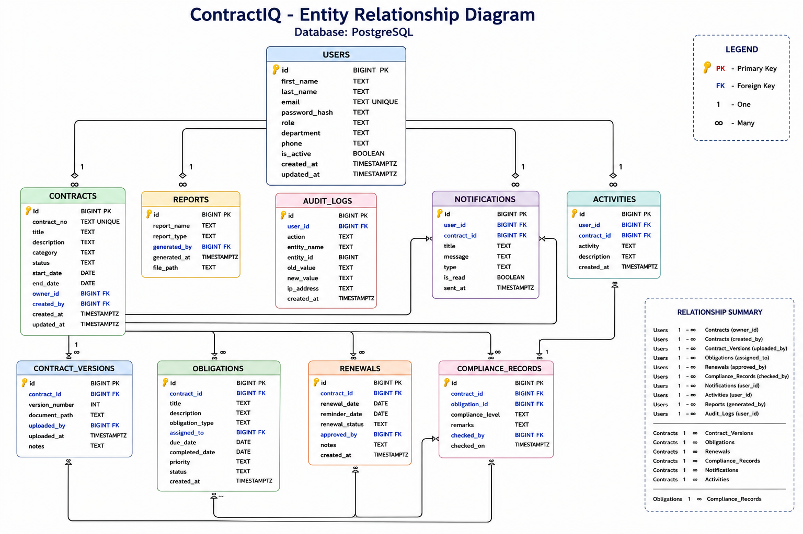

# Entity Relationship Diagram

## Overview

The Entity Relationship Diagram (ERD) represents the logical database structure of the ContractIQ application.

It illustrates:

- Tables
- Primary Keys (PK)
- Foreign Keys (FK)
- One-to-Many Relationships
- Database Entities

---

## Database

PostgreSQL

---

## Main Entities

- Users
- Contracts
- Contract Versions
- Obligations
- Renewals
- Compliance Records
- Notifications
- Activities
- Reports
- Audit Logs

---

## Relationship Summary

### User

- One User can own multiple Contracts.
- One User can upload multiple Contract Versions.
- One User can be assigned multiple Obligations.
- One User can approve multiple Renewals.
- One User can receive multiple Notifications.
- One User can perform multiple Activities.
- One User can generate multiple Reports.
- One User can create multiple Audit Logs.

---

### Contract

- One Contract can have multiple Versions.
- One Contract can have multiple Obligations.
- One Contract can have multiple Renewals.
- One Contract can have multiple Notifications.
- One Contract can have multiple Activities.
- One Contract can have multiple Compliance Records.

---

### Obligation

- One Obligation can have multiple Compliance Records.

---

## ER Diagram

> Replace the image below with your exported ER Diagram.

---

## Design Principles

- Third Normal Form (3NF)
- Primary Keys
- Foreign Keys
- Referential Integrity
- One-to-Many Relationships
- Scalable Database Design